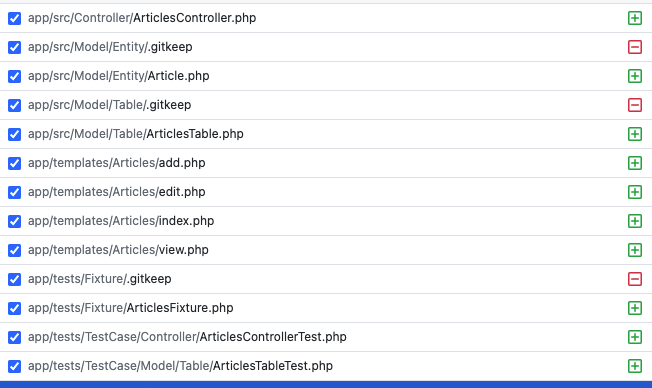
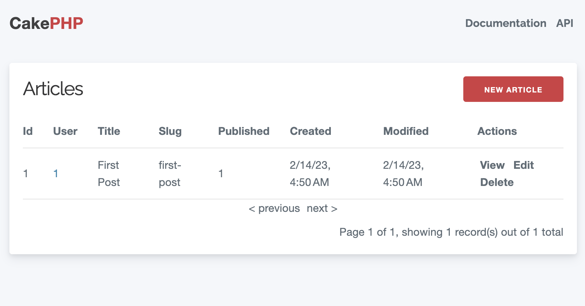
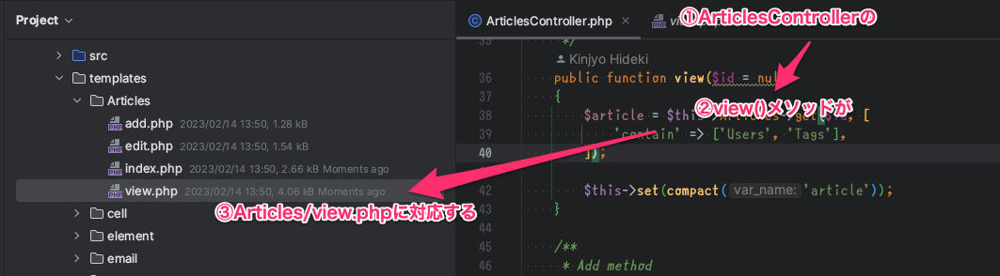
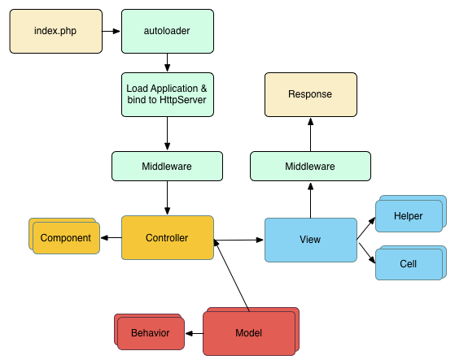

# CakePHPのあらまし

---
# はじめに
「すぐに動く感じのやつ」を用意していますので、手元に置いてください。

1. https://github.com/o0h/20230214-zakkuri-cake をcloneする
2. `make` を実行する
3. http://localhost:8080 を開き、_Welcome to CakePHP 4.4.11 Strawberry (🍓)_ を確認する

---
# ディレクトリツリー
CakePHPアプリケーションの標準構成は以下のようになります。

```
.
├── bin
├── config
│   └── schema
├── logs
├── plugins
├── resources
├── src
│   ├── Console
│   ├── Controller
│   ├── Model
│   └── View
├── templates
├── tests
│   ├── Fixture
│   └── TestCase
├── tmp
├── vendor
└── webroot
```

---
# src + MVC

* アプリケーションコードは `src`に入れていきます
* この中に「MVC」を含めて色々を入れていきましょう
    * Controller = Console, Controller
    * Model = Model/Table, Model/Entity
    * View = View
* ただし「View」と「テンプレート」は別です(cake3以降
    * テンプレートは、`src` と兄弟にいる `templates` ディレクトリに放り込んでいきます
    * デフォルトでは、PHPファイルをそのまま利用します
        * bladeやtwigなどのテンプレートエンジンに置き換えることは可能

---
# それ以外の主要なディレクトリ
* config: アプリケーション設定が突っ込まれる所
* templates: 先述
* tests: テストファイル(データだったり仕組みだったりケースだったり))
* webroot: ドキュメントルート
    * ブラウザにそのまま返すための静的リソースはココに置く

---
# 設定より規約
* M-V(presentation)-Cに対して一環的な名前を付けると、「そのままでそこそこ動く」ような感じになります
* 「リソース」を中心とし、それに対応するクラスやテンプレートを置いていくのが基本形
    * リソースは、DBのテーブルに対応

---
# 設定より規約(2)
例えば、 `articles` テーブルを用意した上で、CakePHPのファイル生成コマンドを叩くことで、以下のようなファイルが作成されます。  
これは、Articlesというリソースを中心として、モデル・CRUDアクションとそのテンプレート・テストが設置された形です



---
##  ファイル生成: bakeコマンド
詳細はドキュメントを。使いこなすととっても便利。

```sh
/opt/project/app # bin/cake bake all -q articles

Baking test case for App\Model\Table\ArticlesTable ...
Baking controller class for Articles...

Baking test case for App\Controller\ArticlesController ...
/opt/project/app # bin/cake bake all -q users

Baking test case for App\Model\Table\UsersTable ...
Baking controller class for Users...

Baking test case for App\Controller\UsersController ...
```

---
# 設定より規約(3)
最低限のCRUD機能が出来上がっており、既にブラウザから動作を確認ができる状態です。まさに「細かく設定せずに」動きました。



---
# 設定より規約(4)



---
# MVCの「外側」
`/webroot/index.php` にリクエストを受けた後に、Application->Middleware->Dispatch->Controller->Middleware と辿ってレスポンスを返すのが処理の流れです。

どこかのタイミングでApplicationとMiddlewareは使う気がするので、何となく頭に入れておいてください。


_https://book.cakephp.org/4/en/intro.html#cakephp-request-cycle_