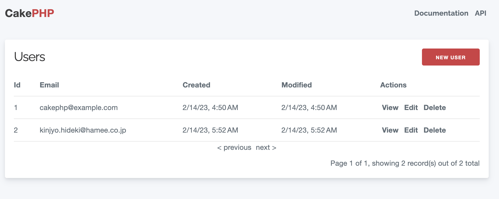
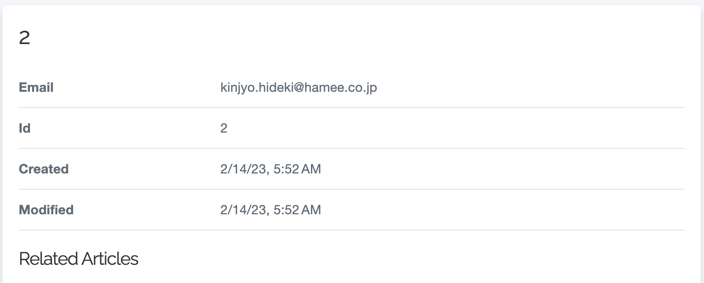
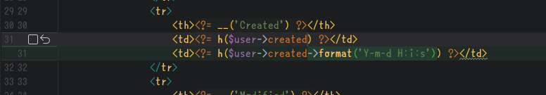
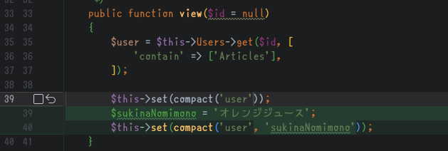
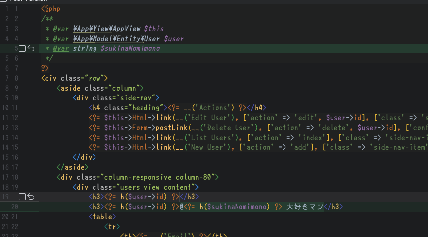

# ルーティングとかコントローラーとかビュー

---
# 今のユーザー

http://localhost:8080/users

---
# デフォルトのルーティング

* `/:controller/:action/:id?` という形式でルーティングされます
* actionは省略されると`index` になります
* すなわち、`/users` は、 `/users/index` と解釈されるものであり、`UsersController::index()` がディスパッチされるものです
* `/users/view/2`は、 `UsersController::view(2)`になります

---
# テンプレートを弄ってみよう
* 日時(created, modified))の形式が分かりにくいですよね
* 直してみましょう

---
# テンプレートを弄ってみよう(2)
* `templates/Users/view.php` を開いてください
* ↓の感じで弄ってみましょう  
* let's reload!

---
# テンプレートを弄ってみよう(3)
* という訳で、
    * アクション毎に対応するテンプレートに
    * 生のPHPを記述する
* のが、CakePHPのデフォルトの画面づくりです！

---
# コントローラーからビューにデータを渡す
* コントローラーからビューにデータを渡すことができます
* `$this->set('view変数名', 'view値')` もしくは、 `$this->set(['view変数名' => 'view値'])` です

---
# コントローラーからビューにデータを渡す(2)
* `UsersController::view()`で、 新しい変数をセットしてみましょう

---
# ビューからデータを読み出す
* `view.php` にも修正を加えましょう
