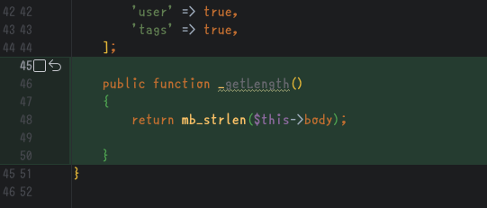
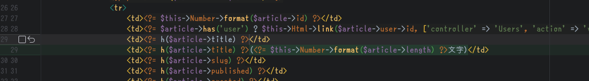

# テーブルとかエンティティ


---
# cakeのモデルの主要な登場人物は2つ！！いや3つかな！！！7つくらいある！
* Query / Table / Entityを最低でも意識しましょう


---
# Table?
* 「レコードの集合体」を抽象化するもの
* テーブル(DB)とエンティティ(クラス)を紐付ける

---
# Entity?
* 「レコード(単体)」を抽象化するもの
* 列(DB))とモデル(アプリ)を紐付ける)
* データとロジックをカプセル化してくれるよ
    * コイツのおかげで連想配列から抜け出せる

---
# Query?
* クエリビルダー、デコレータ
* (Table経由で)DBオブジェクトに渡って、SQLと化す！！！

---
# よく使うやつ

```php
$users = $UsersTable->find()->all(); // Entityのコレクション(に近いもの)))
foreach ($users as $user) {
    $user->id;
    $user->email;
}
$user = $UsersTable->get(1); // ID=1のユーザーのエンティティ
```

---
# もーちょい

```php
$users = $UsersTable->find() // Query
    ->select(['id'])
    ->where(['name' => '鉢巻大好き男']); 
$myArticles = $ArticlesTable->find()
    ->whereIn('id', $users);
```
* みたいな事ができるはず、確か・・・
* 概念的な説明です！メソッドとかがうかも

---
# バリデーション
* [【CakePHP3】バリデーション・アプリケーションルールについて \- Qiita](https://qiita.com/o0h/items/edf1d6821d84ae83495b)
    * 古いので概要だけ掴んだら公式ドキュメントを見て・・・

---
# Entityがロジックを持つとは？
* [【CakePHP3】Entity の機能について\(accessor, virtual fieldsなど\) \- Qiita](https://qiita.com/o0h/items/cb34307ec65c199e79d9)o


