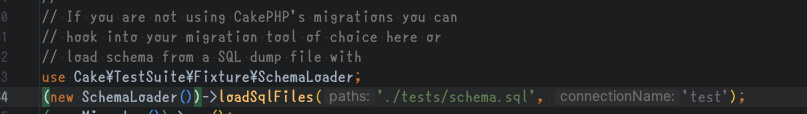

# テストとか

---
# テストDBスキーマ
* 今は`tests/bootstrap.php` で「スキーマを読み込みして初期化」を」をしています<br>
    * cake migration(Phinx)使うならそんな二重管理はしなくて良いかも

---
# フィクスチャ
```
 composer require --dev vierge-noire/cakephp-fixture-factories "^2.5"
 